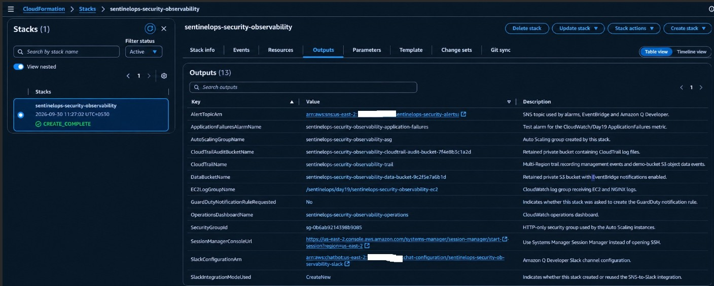
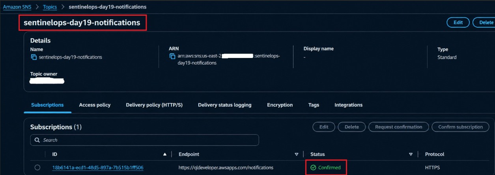
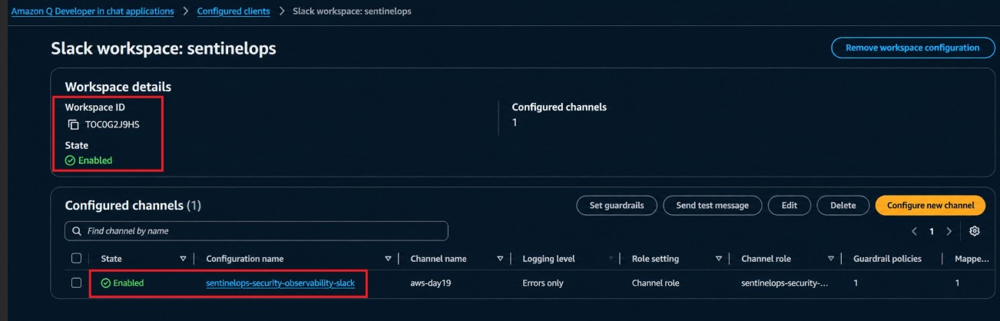
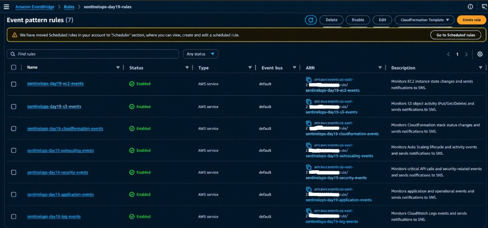
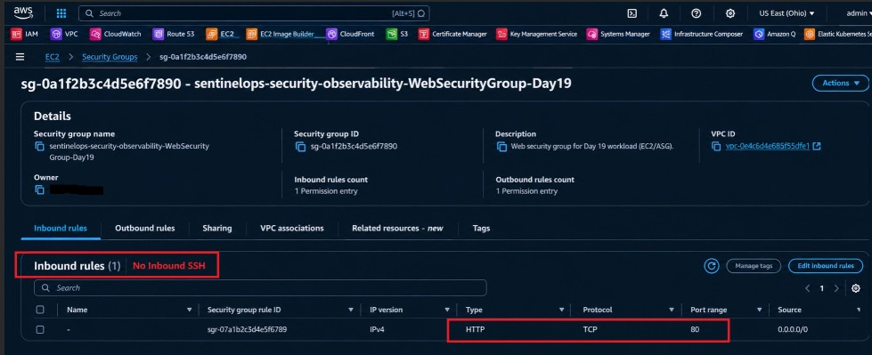
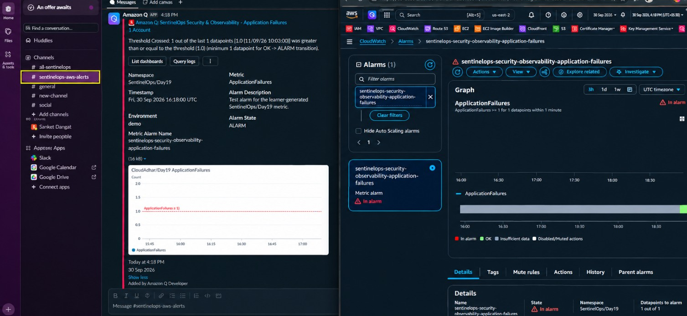
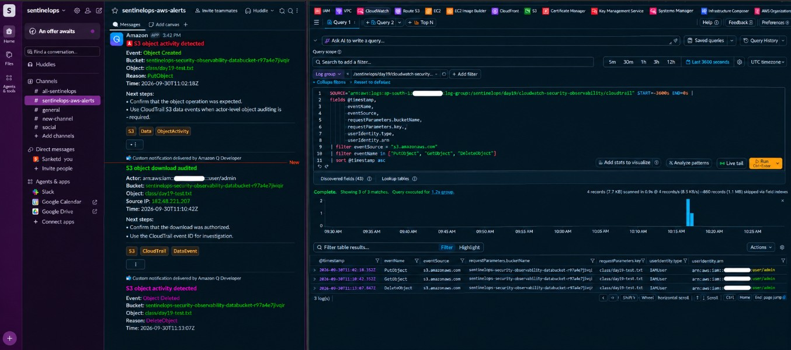

## 𝗗𝗮𝘆 𝟭𝟵 — 𝗖𝗹𝗼𝘂𝗱𝗙𝗼𝗿𝗺𝗮𝘁𝗶𝗼𝗻 𝗦𝗲𝗰𝘂𝗿𝗶𝘁𝘆, 𝗢𝗯𝘀𝗲𝗿𝘃𝗮𝗯𝗶𝗹𝗶𝘁𝘆 & 𝗘𝘃𝗲𝗻𝘁-𝗗𝗿𝗶𝘃𝗲𝗻 𝗔𝗪𝗦 𝗠𝗼𝗻𝗶𝘁𝗼𝗿𝗶𝗻𝗴

---
## 📌 Project Overview

- SentinelOps Security & Observability is an AWS-based security and monitoring platform built using managed AWS services and Infrastructure as Code with AWS CloudFormation.

- The project demonstrates how security events, application failures, S3 activity, CloudTrail audit logs, Auto Scaling events, and CloudFormation status changes can be monitored and routed through CloudWatch, EventBridge, SNS, and Amazon Q Developer in chat applications (Slack).

- The application also includes an EC2-based web workload running Nginx, with secure access through AWS Systems Manager Session Manager without inbound SSH, while IAM roles, security groups, CloudTrail, and CloudWatch provide centralized security, auditing, and observability.

---
## Result

Successfully implemented a CloudFormation-driven AWS Security and Observability environment that brings infrastructure deployment, application monitoring, security auditing, and real-time alerting together in a single workflow.

Resources created:

- AWS CloudFormation Stack
- EC2 Web Server with Nginx
- Auto Scaling Group and Launch Template
- CloudWatch Logs and Custom Metrics
- CloudWatch Alarm and Operations Dashboard
- Private S3 Application Data Bucket
- CloudTrail Audit Trail with S3 Data Events
- Amazon EventBridge Security and Application Rules
- Amazon SNS Alerting Topic
- Amazon Q Developer Slack Channel Integration
- IAM Roles and Policies
- HTTP-only Security Group
- AWS Systems Manager Session Manager

Validation:

- Validated the complete monitoring and alerting flow by generating application failures, observing CloudWatch alarm state changes, routing alerts through SNS and EventBridge to Slack, accessing the EC2 workload through Session Manager without SSH, and performing S3 object operations to verify PutObject, GetObject, and DeleteObject events in CloudTrail and CloudWatch Logs Insights.
---
## 1. CloudFormation Stack, Resources and Outputs

- Deployed the SentinelOps Security and Observability infrastructure using AWS CloudFormation and verified successful stack creation, provisioned AWS resources, and generated stack outputs for monitoring, security, logging, and notification components.

---
## 2. SNS Notification Topic

- Configured and verified the SentinelOps SNS notification topic for centralized delivery of security and observability alerts to the integrated Amazon Q Developer Slack channel.

---
## 3. Amazon Q Developer Slack Integration

- Configured and validated the SentinelOps Amazon Q Developer Slack integration, connecting the aws-day19 channel to the monitoring workflow for receiving real-time AWS security and observability notifications.

---
## 4. EventBridge Security and Observability Rules

- Configured and validated the SentinelOps EventBridge rules for monitoring AWS infrastructure and security activity, including EC2 and Auto Scaling events, S3 object operations, CloudFormation stack changes, and security-related API activity.

---
### 5. Session Manager Access Without Inbound SSH

- Successfully accessed the SentinelOps EC2 instance through AWS Systems Manager Session Manager, providing secure administrative access without exposing an inbound SSH port in the security group.

---
## 6. CloudWatch Dashboard, ApplicationFailures Alarm and Slack Notification

- Configured and validated the SentinelOps CloudWatch monitoring workflow, confirming the ApplicationFailures alarm transitioned to the ALARM state and successfully delivered the alert to the configured Slack channel through SNS and Amazon Q Developer.

---
## 7. S3 Activity Alerts and CloudTrail Audit

- Performed SentinelOps S3 object operations including upload, download, and deletion, then validated the resulting security notifications and CloudTrail audit records for PutObject, GetObject, and DeleteObject using CloudWatch Logs Insights.

---
## 🧹 Cleanup

After completing the SentinelOps Security and Observability validation, the AWS resources were removed to avoid unnecessary charges.

- Delete the CloudFormation stack sentinelops-security-observability.
- Verify that Day 19 resources such as EC2, Auto Scaling, CloudWatch, EventBridge, SNS, and CloudTrail have been removed.
- Empty and delete the SentinelOps S3 buckets used during the project.
- Remove the Amazon Q Developer / Slack integration configuration and workspace connection.
- Verify that no billable Day 19 resources remain in us-east-2 (Ohio).

---
## 🎯 What I Learned

Through this SentinelOps Security and Observability project, I practiced:

- Creating AWS infrastructure using CloudFormation YAML
- Managing AWS infrastructure as code (IaC)
- Working with CloudFormation parameters and outputs
- Deploying and managing EC2 instances and Auto Scaling Groups
- Creating and configuring EC2 Launch Templates
- Securing EC2 workloads using IAM roles and Security Groups
- Accessing EC2 instances using AWS Systems Manager Session Manager
- Managing EC2 access without exposing inbound SSH
- Configuring Amazon S3 for application data and security auditing
- Monitoring S3 object activity using CloudTrail data events
- Auditing PutObject, GetObject, and DeleteObject operations
- Using CloudWatch Logs and Logs Insights for security analysis
- Creating CloudWatch custom metrics and alarms
- Building an operational CloudWatch Dashboard
- Creating Amazon EventBridge rules for AWS security and operational events
- Monitoring EC2, Auto Scaling, S3, CloudFormation, and API activity
- Configuring Amazon SNS for centralized alert notifications
- Integrating Amazon Q Developer with Slack for real-time alerts
- Testing application failure detection using the ApplicationFailures metric
- Validating the complete CloudWatch → SNS → Amazon Q → Slack notification flow
- Understanding AWS security monitoring and audit workflows
- Practicing infrastructure deployment, monitoring, validation, and cleanup
- Building a practical AWS Security and Observability architecture using managed AWS services

---
## 👨‍💻 Author

Hardik Darji
> DevOps Engineer

---
## ⭐ Support

If you found this SentinelOps Security and Observability project useful, consider giving it a ⭐ on GitHub.
